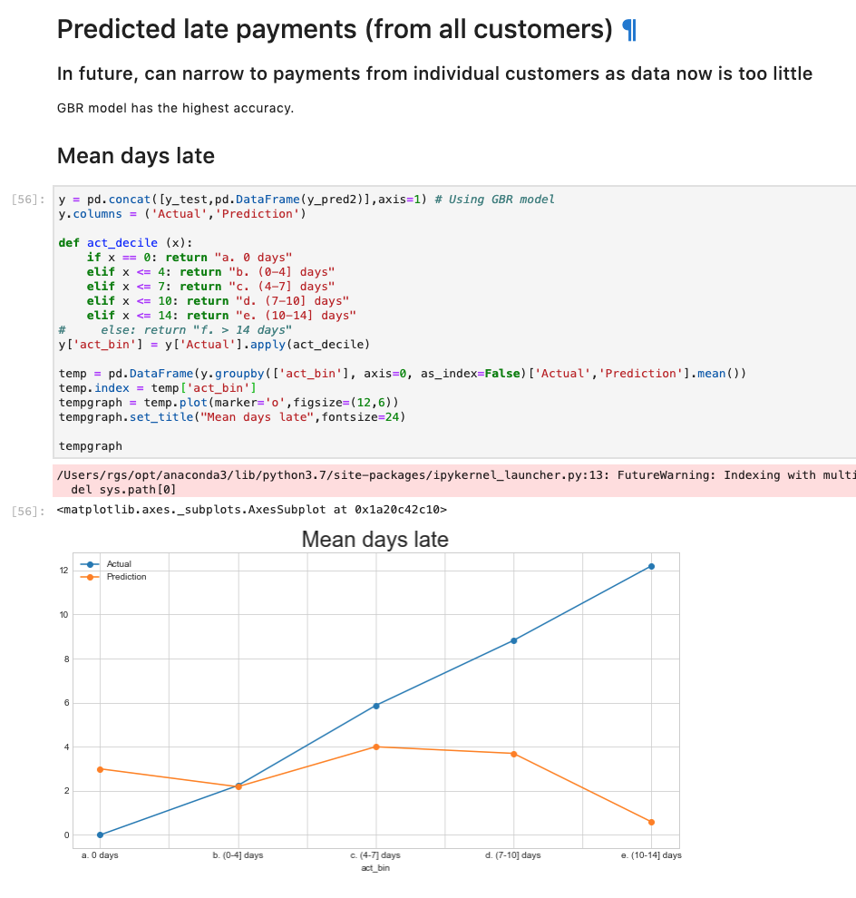
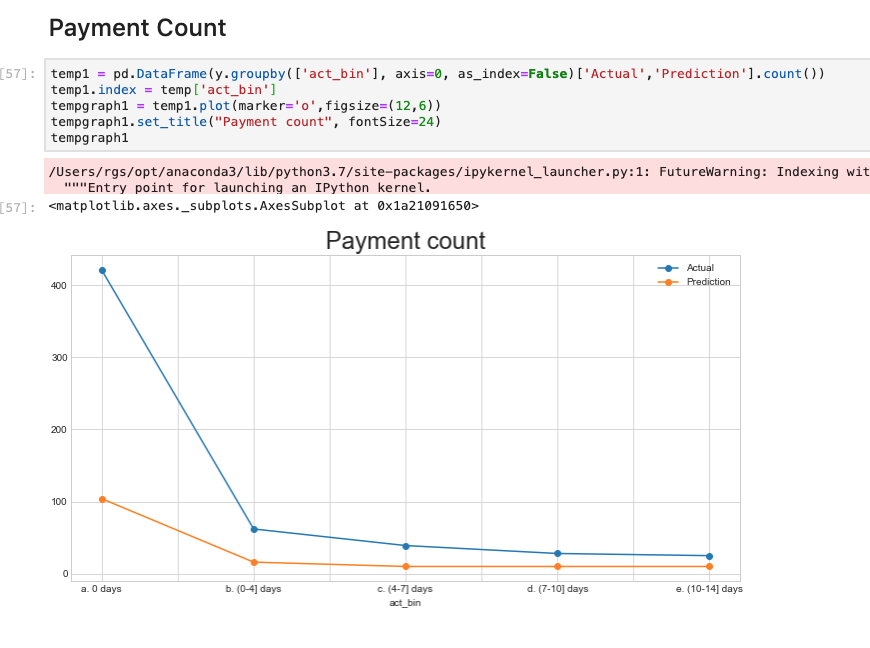

# Key info

Late payments predictions and metrics will go in the `Chasing debtors` tab where users can view profiles of individual customers / vendors. 

### Two key metrics:
#### 1. Percentage of late payments of a customer

  

#### 2. Prediction of when payments will be late (in total, not enough data for individual customers)
The model doesn't predict well for >7 days, probably due to lack of data.

The `Forecasted Days Late` metric under `Target Setting` tab can be predicted once we have individual client data, but for now we don't have it. 

  
  

