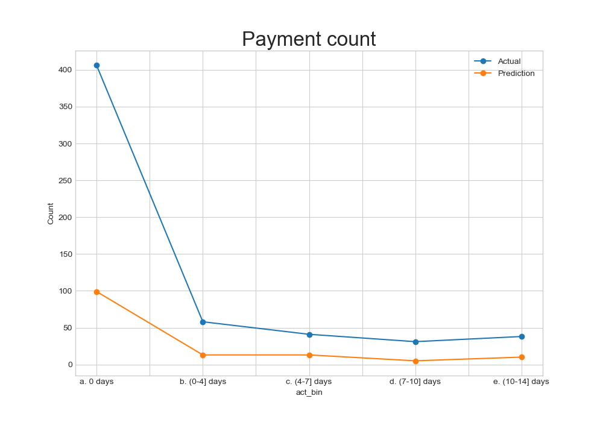

# Key info

Late payments predictions and metrics will go in the `Chasing debtors` tab where users can view profiles of individual customers / vendors. 

`percent_late.py` outputs the percentage of late payments of a customer / vendor based on their payment history, and saves it into `output/percentage_late.txt`.

`train.py` contains a model (Gradient Boosting Regression) that predicts how late the client will receive their invoice payments, as well as forecasted date of payment for its customers / vendors. It outputs and saves the forecasted payment date into `output/predicted_date.txt`, and graphs into `output/mean_days_late.png`, `output/payment_count.png`. 

`combined.ipynb` is a combination of the two scripts above, along with data exploration and model experimentation (3 models).

## Key metrics:
#### 1. Percentage of late payments of a customer

From `percent_late.py`.

  

#### 2. Prediction of when payments will be paid (total)

From `train.py`.

The model doesn't predict too well for > 10 days, probably due to a lack of data.

The `Forecasted Days Late` metric under `Target Setting` tab will be the output of `predicted_date.txt` generated by `train.py` . 

  
  

#### 3. Forecasted payment date

From `train.py`.

Forecast payment date for a sample invoice (given under `sample_invoice.csv`) of a company, given the following invoice information: 

`customerID, invoice_date, due_date, invoice_amount, disputed, late`

  

